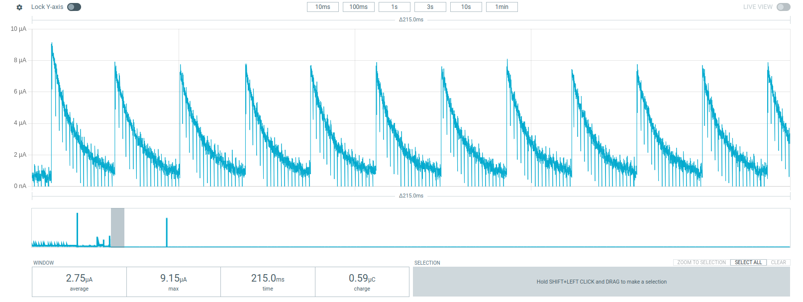

# Async UART w/ ~2uA Sleep Current

This example uses the async UART API and the Zephyr console. It also uses device power management to suspend the UARTs, resulting in the following power consumption:

Async UART requries that the Kconfig "CONFIG_UART_x_ASYNC" be set. If this is not set, the async UART driver for Nordic chips will not be properly suspended, showing ~500uA of current consumption while the high frequency clock is enabled.

To run the example, build for your target board and bridge the uart1 TX + RX pins with a jumper wire.

This is a very simple example and does not properly leverage the useful (i.e. asynchronous) features of the async UART API. Please refer to this video from CircuitDojo for more information https://www.youtube.com/watch?v=ikRS9XXZGGA and to the Zephyr docs https://www.youtube.com/watch?v=ikRS9XXZGGA 